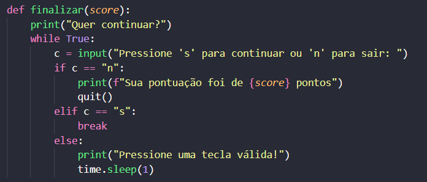
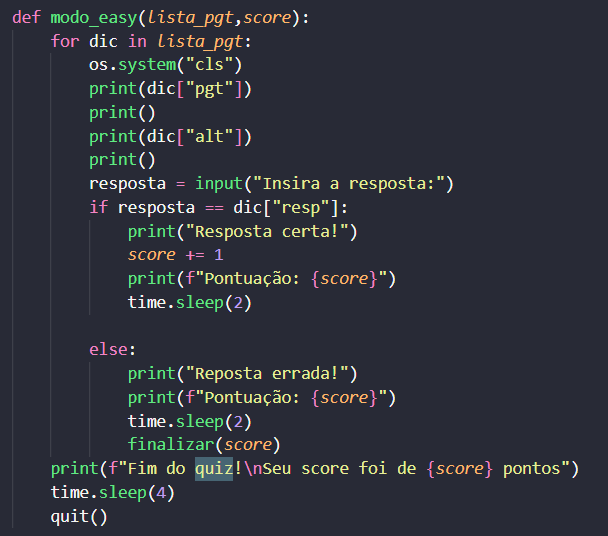
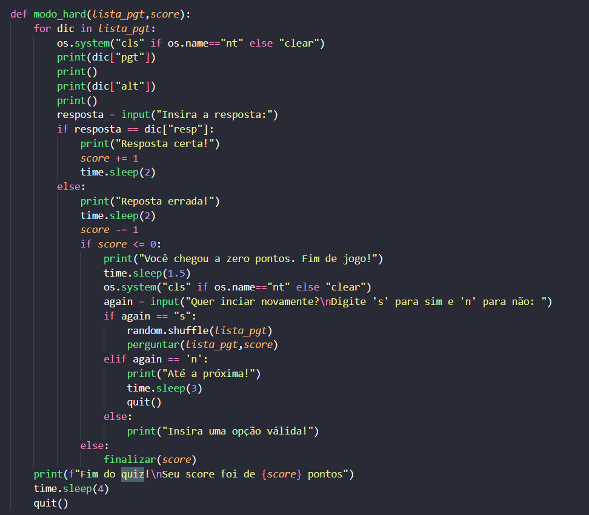
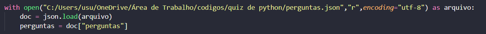
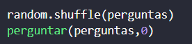

# Quiz de Pyhton e SQL

Este projeto é de um **Quiz de Pyhton e SQL** porém o código pode ser aproveitado e usar as suas próprias perguntas, basta editar o arquivo "perguntas.json".

---
#  Funcionamento das Funções

**finalizar(score)**

Ao errar uma pergunta, o é perguntado se o usuário deseja continuar.
Caso sim, a próxima pergunta é exibida, caso não, a pontuação total é exibida e o quiz é encerrado.
Recebe como parâmetro o score do usuário, que será passado na função **perguntar**.

**modo_easy(lista_pgt, score)**

Nesse modo, a cada pergunta respondida corretamente o usuário ganha um ponto, e não perde nada caso errar.
Além disso, a pontuação é exibida a cada pergunta.
Se o usuário errar a resposta, a função **finalizar()** entra em jogo.
Recebe como parâmetros a lista de perguntas do documento "perguntas.json" e o score do usuário, que serão passados na função **perguntar**.

**modo_hard(lista_pgt, score)**

Nesse modo, a cada pergunta respondida corretamente o usuário ganha um ponto, e a cada erro, perde um ponto.
A pontuação não é exibida, para dificultar o jogo. Além disso, o quiz é encerrado caso a pontuação do usuário chegue novamente a zero após o início do quiz.
Após a finalização do quiz, o usuário tem a opção de reiniciar o quiz ou não.
Caso o usuário erre alguma pergunta e isso não faça sua pontuação zerar, a função **finalizar** entra em jogo.
Recebe como parâmetros a lista de perguntas do documento "perguntas.json" e o score do usuário, que serão passados na função **perguntar**.

**perguntar(lista_pgt, score)**

Essa função é a tela inicial do quiz. 
Nessa função o modo de jogo é definido.  
Após a seleção do modo de jogo, o quiz se inicia dentro das funções **modo_easy** ou **modo_hard**.
Recebe como parâmetros a lista de perguntas do documento "perguntas.json" e o score inicial do usuário.

# Carregamento das Perguntas (JSON)

As perguntas são carregadas automaticamente com:

Esse código:

Abre o arquivo JSON;
Converte para dicionário;
Acessa a lista "perguntas";

# Iniciar o quiz

Para iniciar o quiz, usamos **random.shuffle(perguntas)** para que as perguntas sejam embaralhadas sempre que o quia iniciar, e então chamamos a função **perguntar(perguntas,0)**, onde passamos a lista de perguntas e o score.
